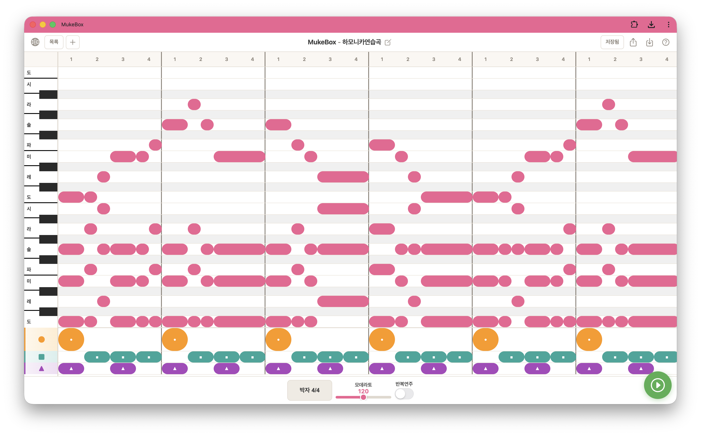

# MukeBox

음표 길이(온음표~16분음표)를 직접 만들고 연주하는 **교육용 악보+연주 웹앱**입니다.  
Chrome Music Lab [Song Maker](https://musiclab.chromeexperiments.com/Song-Maker/)에서 영감을 받았으며, 수업에서 리듬과 멜로디를 시각적으로 배치하고 즉시 소리로 확인할 수 있습니다.

## 바로 실행하기

별도 설치 없이 브라우저에서 바로 사용할 수 있습니다.

MukeBox 접속주소 : **[https://mcnorton.github.io/mukebox/](https://mcnorton.github.io/mukebox/)**  
(학교 방화벽에서 `github.io`가 차단된 경우 → **[https://mukebox.vercel.app](https://mukebox.vercel.app)**)

1. 위 주소로 접속합니다.
2. 화면 오른쪽 아래 **▶ 재생** 버튼을 누르면 소리가 재생됩니다.
3. 피아노 칸을 탭해 음표를 넣고, 하단에서 박자·템포를 조절해 보세요.

> PC·태블릿·스마트폰의 Chrome, Safari, Edge 등 최신 브라우저에서 동작에 적합합니다.  
> PWA 설치·오프라인 캐시는 `https://` 환경에서 동작하므로 GitHub Pages 또는 Vercel 주소로 접속하면 됩니다.

## 예제 악보 불러오기

[score/](score/) 폴더에 예제 악보 ZIP 파일이 있습니다.

- [MukeBox - 하모니카연습곡.zip](https://github.com/mcnorton/mukebox/blob/main/score/MukeBox%20-%20하모니카연습곡.zip) — 하모니카연습곡
- [MukeBox - 똑같아요.zip](https://github.com/mcnorton/mukebox/blob/main/score/MukeBox%20-%20똑같아요.zip) — 똑같아요
- [MukeBox - 학교종이 땡땡땡.zip](https://github.com/mcnorton/mukebox/blob/main/score/MukeBox%20-%20학교종이%20땡땡땡.zip) — 학교종이 땡땡땡

1. [score/](score/) 폴더에서 원하는 ZIP 파일을 **다운로드**합니다.
2. 다운로드한 ZIP을 **압축 해제**해 `.json` 파일을 꺼냅니다.
3. [MukeBox](https://mcnorton.github.io/mukebox/)에 접속합니다.
4. 헤더 우측 **가져오기** 버튼(↓ 아이콘)을 누릅니다.
5. 압축을 푼 `.json` 파일을 선택합니다.
6. 악보가 열리면 **▶ 재생**으로 들어 보세요. **목록**에서도 불러온 악보를 다시 열 수 있습니다.

저장소를 클론한 경우 ZIP을 풀어 나온 `.json` 파일을 바로 선택해도 됩니다.

## 기본 기능

### 악보 만들기

- **피아노 (C3~C5)** — 건반별 레인에 칸을 탭해 멜로디·화음을 넣습니다.
- **큰북** — 타악기 행, 칸을 탭해 on/off 합니다.
- **음표 길이** — 칸을 길게 누르거나 더블클릭하면 4분→8분→16분음표로 나뉩니다. 같은 음의 인접 칸을 드래그하면 합쳐집니다.
- **마디 추가** — 오른쪽 **+** 버튼으로 마디 4개를 추가합니다.

### 연주

- **재생 / 정지** — 화면 오른쪽 아래 ▶ 버튼.
- **박자** — 2/4, 3/4, 4/4, 6/8 (변경해도 음표 형태는 유지됩니다).
- **템포** — 아다지오(60)~프레스토(160) 프리셋.
- **반복 연주** — 하단 반복 스위치.

### 악보 관리

- **목록** — 여러 악보를 저장하고 불러옵니다.
- **새 악보** — 헤더 **+** 버튼으로 새 작업을 시작합니다.
- **이름 변경** — 제목 옆 편집 버튼.
- **자동 저장** — 편집 후 약 10초 뒤 브라우저에 자동 저장됩니다. **저장** 버튼으로 즉시 저장할 수도 있습니다.
- **보내기 / 가져오기** — JSON 파일로 내보내거나 불러옵니다.

### 기타

- **한글 / English** — 헤더 왼쪽 지구본 아이콘으로 언어를 바꿉니다.
- **사용 방법** — 헤더 **?** 버튼에서 조작법을 확인합니다.

## 태블릿·폰에 설치하기 (PWA)

GitHub Pages 주소로 접속한 뒤 홈 화면에 추가하면 앱처럼 전체화면으로 사용할 수 있고, 오프라인에서도 동작합니다.

- **Android / Chrome** — 헤더 우측 **설치** 버튼 (또는 브라우저 메뉴 → 앱 설치)
- **iPad / iPhone / Safari** — 공유 → **홈 화면에 추가** (헤더 **설치** 버튼을 누르면 단계별 안내가 표시됩니다)

## 사용 방법 요약

1. 피아노 칸을 탭해 음을 켜고 끕니다.
2. 칸 **길게 누르기**(또는 더블클릭) → 절반으로 분할.
3. 인접 칸 **드래그** → 즉시 병합.
4. 하단에서 **박자(Meter)**·**템포**를 바꿉니다.
5. **▶** 재생/정지, **↻** 반복 연주.

## 라이선스

교육용 프로젝트 — 자유롭게 수정·활용 가능합니다.